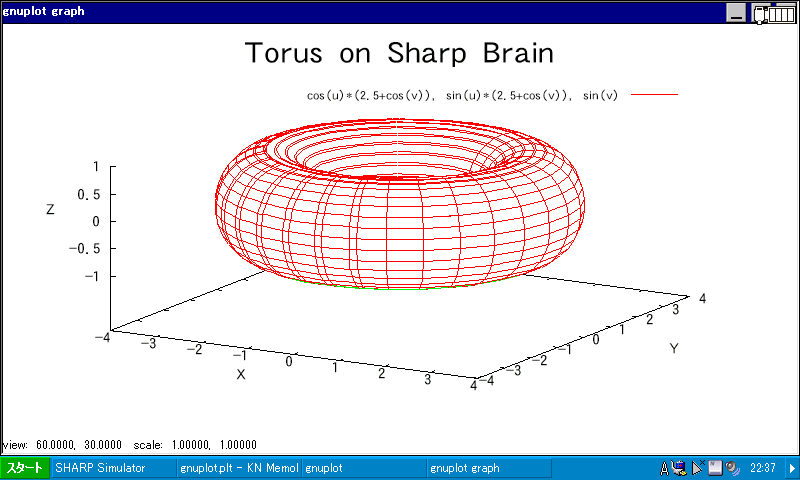

# Gnuplot 4.4.3 for Windows CE Rev. 3

  
  

This is a _Windows CE only partial_ port of Gnuplot 4.4.3. This port is as destructive as dropping the support for environments other than Windows Mobile 5.0 Pocket PC SDK on Visual Studio 2005/2008, and implementing only basic features. This is a slight update incorporating some fixes and small improvements to the [Rev. 1](https://kawamoto.no-ip.org/henteko/myapp/gplotwce4431.zip) made by [Suguru Kawamoto](https://github.com/skawamoto0).

## How To Use

Download from [Releases](../../releases), extract it into a ASCII-only path (the top folder is recommended), and run `wgnuplot.exe` on your device. Notable things about this port follows:

- Devices with Windows CE 5.0 or later OS and Armv5 CPU are supported
- Default font for the console screen is `MS Gothic`
- On console and graph screens, you can change the font from the right-click menu
  - Use `app` key on a screen keyboard app on devices where right-clicking is not possible
  - If the console screen is not displayed correctly, use this feature to change the font
- Font anti-aliasing is enabled on console and graph screens
- Character encoding is UTF-8
  - You can use international characters on the menu bar and in `.plt` files, by making them in UTF-8
  - You can use non-ASCII characters on the console although they don't show up while on there
  - To correctly render a graph contains non-ASCII characters, you must set a font that has needed glyphs
- Fixed an issue from Rev. 1 where the overflowed area of the menu bar did not appear when the width of the console screen was narrow, even if the window was expanded
- Fixed some warnings from Rev. 1 in the source code

Following features which were not available in Rev. 1, are still not supported:

- Current directory
- Outputting a graph to a file
- Printing
- Selecting a different output device
- Opening a DOS window
- Help
- Dump
- `wgnuplot.ini`
- Buttons under the menu bar

## How To Build

Use the `.sln` file located in `vs2005`/`vs2008` on Visual Studio 2005/2008. "Smart Device Programability" and [Windows Mobile 5.0 Pocket PC SDK](https://www.microsoft.com/en-us/download/details.aspx?id=42) must be installed to build this project. Also, you must specify a `commdlg.lib` file which comes with a Windows CE SDK (Windows CE 5.0 recommended, which is available from [Microsoft](https://www.microsoft.com/en-us/download/details.aspx?id=17310) and [Toradex](https://docs.toradex.com/102479)) at "Linker > Input > Additional Dependencies" in the Project Properties dialog. This file is usually present in `Lib\ARMV4I` in the SDK.

## License

My ([watamario15](https://github.com/watamario15)'s) modifications are provided as public domain. If you want more formal license, I will license my modifications under the terms of the [CC0-1.0](https://creativecommons.org/publicdomain/zero/1.0/) license. However, this work is just a modification of another piece of software. Carefully read original documents (especially [Copyright](Copyright)) and [Suguru's readme](readme-kawamoto.txt) before using this software.

My contact information can be obtained by invoking the `git log` command within the Git repository.

---

# Gnuplot 4.4.3 for Windows CE Rev. 3

  
  

これは **Windows CE 専用で部分的な** Gnuplot 4.4.3 の移植版です。破壊的な移植なので、Visual Studio 2005/2008 上の Windows Mobile 5.0 Pocket PC SDK のみに対応し、実装されている機能も最低限です。[川本優](https://github.com/skawamoto0)氏の [Rev. 1](https://kawamoto.no-ip.org/henteko/myapp/gplotwce4431.zip) に対し、修正や少しの改良を施した版となります。

## 実行方法

[Releases](../../releases) からダウンロード・展開し、日本語などの非 ASCII 文字を含まない場所（最上層を推奨）に配置します。その後、`wgnuplot.exe` を直接起動します。日本語を含むパスに配置できない制約から `アプリ` フォルダに配置できないので、辞書アプリからの起動には対応しません。Explorer や ceOpener などを用いてください。この移植版には以下の性質があります。

- Armv5 CPU を搭載する Windows CE 5.0 以降の端末で動作します
- コンソール画面のデフォルトフォントは `MS Gothic` です
- コンソール画面とグラフ画面において、右クリックメニューからフォント変更が可能です
  - 右クリックできない環境では Screen Keyboard の `app` キーなどを用います
  - コンソール画面が正しく表示されていない場合は、ここでフォントを変更してください
- コンソール画面とグラフ画面でフォントアンチエイリアスを有効化しています
- 文字コードは UTF-8 です
  - 日本語を表示できる環境では、元の `wgnuplot.mnu` を削除・移動・改名などした上で `wgnuplot-ja.mnu` を `wgnuplot.mnu` に改名するとメニューを日本語化できます
  - UTF-8 で作成すれば `.plt` ファイルで日本語が使えます
  - コンソール画面での直接入力でも日本語等を使用できますが、コンソール上では ASCII 文字のみが表示されます
  - グラフにおいて日本語などの非 ASCII 文字を表示する場合は、必要なグリフを持つフォントを指定する必要があります
- Rev. 1 に存在した、コンソール画面の幅が狭いとき、ウィンドウを広げてもメニューバーのはみ出した領域が現れない不具合を修正しています
- Rev. 1 に存在した、プログラム上の警告などをある程度修正しています

Rev. 1 が対応しない以下の機能は、この版でも使用できません。

- カレントディレクトリ
- グラフのファイル出力
- 印刷
- 出力デバイスの選択
- DOS 窓
- ヘルプ
- ダンプ
- `wgnuplot.ini`
- メニューバーの下のボタン

## ビルド方法

Visual Studio 2005/2008 を用いて `vs2005`/`vs2008` フォルダ内の `.sln` ファイルを開き、ビルドします。「スマート デバイス プログラマビリティ」と [Windows Mobile 5.0 Pocket PC SDK](https://www.microsoft.com/en-us/download/details.aspx?id=42) が必須です。さらに、プロジェクトプロパティの「リンカ > 入力 > 追加の依存ファイル」にて通常の Windows CE SDK（[Microsoft](https://www.microsoft.com/en-us/download/details.aspx?id=17310) や [Toradex](https://docs.toradex.com/102479) から入手できる Windows CE 5.0 用のものを推奨）に含まれる `commdlg.lib` を指定する必要があります。このファイルは大抵 SDK 内の `Lib\ARMV4I` にあります。

## ライセンス

私（[watamario15](https://github.com/watamario15)）の変更分に関しては public domain とします。より正式なライセンスが必要な場合は [CC0-1.0](https://creativecommons.org/publicdomain/zero/1.0/) でライセンスします。ただし、本ソフトウェアはあくまでも既存ソフトウェアへの修正に過ぎないことに注意し、元の Gnuplot の文書（特に [Copyright](Copyright)）や[川本氏の readme](readme-kawamoto.txt) を必ず確認してください。

私への連絡先は、Git リポジトリ内で `git log` コマンドを打つことで取得できます。
